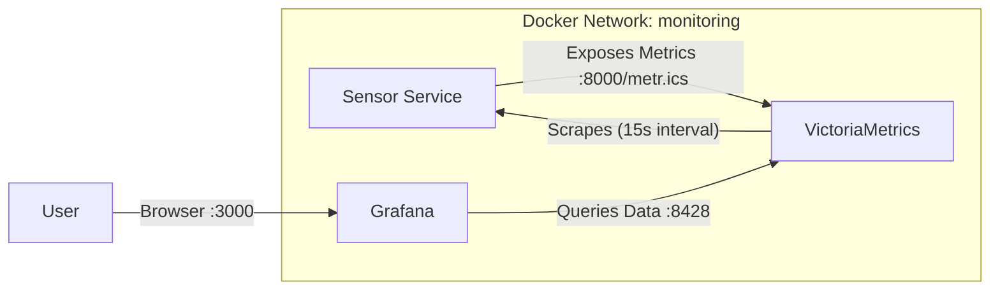

# Resource-Constrained Edge Observability Stack

Implemented a highly optimized observability stack designed for an edge computing robot module (2-core CPU, 500MB RAM).
The entire stack (Application + Database + Visualization) runs with a strictly enforced memory budget of **< 300 MB**.

## Setup Guide

### Prerequisites
*   **Docker Desktop** (or Docker Engine + Docker Compose) installed.
*   **Git** (optional, for cloning).

### Installation & Running

1.  **Clone/Open the repository**:
    Ensure you are in the directory containing `docker-compose.yml`.

2.  **Launch the Stack**:
    Run the following command to build and start all services in detached mode:
    ```bash
    docker-compose up -d
    ```

3.  **Verify Running Containers**:
    Check that all three containers (`sensor-service`, `victoria-metrics`, `grafana`) are up:
    ```bash
    docker-compose ps
    ```

### Accessing the Dashboard

1.  Open your browser to [http://localhost:3000](http://localhost:3000).
2.  Login with default credentials:
    *   **User**: `admin`
    *   **Password**: `admin`
3.  Add the Data Source (if not pre-provisioned):
    *   **Type**: Prometheus
    *   **Connection URL**: `http://victoria-metrics:8428` (Important: Use this internal Docker hostname, NOT localhost).
  
4. Create a Dashboard out of it, according to the requirements:


## Data Flow Diagram



## Architecture

Replaced the standard heavyweight Prometheus stack with **VictoriaMetrics** to save resources.

| Service | Technology | Role | Memory Limit |
| :--- | :--- | :--- | :--- |
| `sensor-service` | Python 3.10-slim | Simulated IoT Sensor | **50 MB** |
| `victoria-metrics` | VictoriaMetrics | Time-Series Database | **100 MB** |
| `grafana` | Grafana | Visualization | **150 MB** |

### Resource Verification

To verify that the optimization requirements are met (< 300MB Total RAM), run:
```bash
docker stats
```

## Key Optimizations

### 1. Code Optimization (`sensor_service.py`)
*   **CPU Fix**: Removed a busy-wait loop (`range(2000000)`) that caused 100% CPU spikes. Replaced with non-blocking `time.sleep`.
*   **Memory Fix**: Eliminated a random 5-15MB string allocation per request to stabilize heap usage.
*   **New Metrics**: Added `sensor_queue_depth` to track saturation.

### 2. Infrastructure Tuning
*   **Database**: Switched from Prometheus (~200MB+ min) to VictoriaMetrics (~30-90MB).
*   **Container**: Used `python:3.10-slim` + `--no-cache-dir` to reduce image size.
*   **Limits**: Docker hard limits enforced (`mem_limit`) to prevent OOM kills impacting the host.

## Performance Budget

The system is currently running well within the 300MB limit:

| Component | Usage |
| :--- | :--- |
| Sensor | ~29 MB |
| VictoriaMetrics | ~91 MB |
| Grafana | ~134 MB |
| **Total** | **~254 MB** |


## Design Approach & Decisions

### Why VictoriaMetrics? (vs. Prometheus)
We selected **VictoriaMetrics (Single Node)** over standard Prometheus because:
*   **Efficiency**: It uses significantly less RAM for active series caching compared to Prometheus.
*   **Architecture**: A single static binary with no external dependencies, ideal for "edge" usage.
*   **Compatibility**: Drop-in compatible with Prometheus scrape configs.

### Visualization Strategy
Retained **Grafana** despite its weight (130MB+) because it provides the industry-standard interface. To ensure fit:
*   Enforced `GF_SERVER_ENABLE_GZIP=true` for network efficiency.
*   Set a strict Docker hard limit of 150MB.

### Scrape Strategy
*   **Interval**: Increased to **15s** (from 5s).
*   **Reason**: On an edge device, 5s resolution creates excessive CPU context switching. 15s is sufficient for trending without overwhelming the sensor.

## Future Improvements
Deploying on a `distroless` image would reduce the container size from ~150MB to <30MB and cut startup time by 80%.
